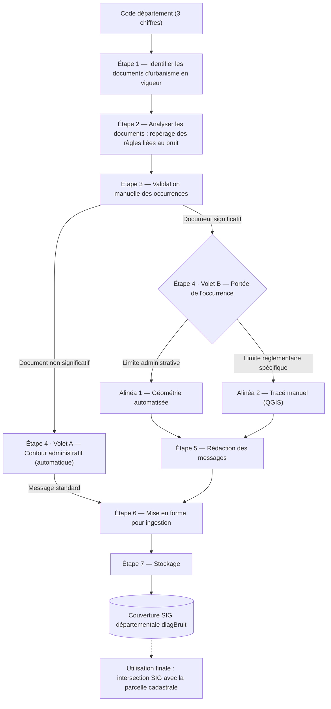

# Plan d'action — Automatisation de l'intégration des règles d'urbanisme liées au bruit dans diagBruit

*Document de cadrage du plan d'ensemble. Chaque étape est détaillée dans son propre document de doc/ (`etape-N-*.md` pour le contenu métier, `etape-N-conception-technique.md` pour le détail d'implémentation).*

## Objectif final

Ajouter automatiquement dans diagBruit de nouvelles règles issues des plans locaux d'urbanisme (PLU, PLUi, RNU, POS, cartes communales...) disponibles sur le Géoportail de l'urbanisme, en complément des informations déjà fournies par diagBruit (plan d'exposition au bruit, classement sonore des voies).

## Les deux échelles du produit

diagBruit fonctionne sur deux échelles distinctes qu'il ne faut pas confondre :

- **Échelle d'intégration d'un territoire** : le **département**. diagBruit n'est pas disponible France entière ; les territoires sont ajoutés progressivement, département par département.
- **Échelle d'utilisation** : la **parcelle cadastrale**. C'est le niveau auquel l'utilisateur final interroge l'outil.

Le présent plan porte sur la **création de la donnée à l'échelle départementale** (le pivot amont), qui sera ensuite consommée à l'échelle parcellaire par une requête SIG d'intersection.

## Sortie visée

Une **couverture SIG complète du département**, composée de surfaces qui traduisent les endroits où s'appliquent des règles d'urbanisme liées au bruit (hors classement sonore et plan d'exposition au bruit, déjà traités par ailleurs).

Règles de construction de cette couverture :
- Plusieurs surfaces peuvent se **chevaucher** si plusieurs règles s'appliquent à un même endroit.
- En revanche, **un seul document d'urbanisme en vigueur** doit être pris en compte par localisation (le PLU, le PLUi, le RNU, le POS ou la carte communale actuellement opposable — jamais une version archivée, et pas de superposition PLU/PLUi puisqu'une commune intégrée à un PLUi n'a normalement plus de PLU propre en vigueur).
- La granularité visée est celle de la **zone réglementaire** (et non la commune), quitte à ce que la construction de cette zone reste manuelle dans un premier temps — auquel cas un message explicite sur l'origine et la précision de la donnée sera nécessaire.

Le pivot fonctionnel : diagBruit interroge cette couverture via une **requête SIG d'intersection** entre la géométrie de la parcelle cadastrale et les géométries des zones précédemment créées.

## Schéma du plan

*Ce schéma représente le flux global département → couverture SIG. Il ne détaille pas séparément le cas RNU/trou de couverture, qui rejoint le flux normal dès l'étape 3 plutôt que d'apparaître comme une branche à part — voir "Points de vigilance retenus" ci-dessous pour le détail.*

## Étapes du plan

1. **Identifier les documents d'urbanisme en vigueur du département**, à partir du code département (3 chiffres), via le Géoportail de l'urbanisme.
2. **Analyser les règlements écrits de ces documents** (un pré-filtrage par mots-clés réduit le texte soumis à l'analyse IA) pour repérer toute mention de recommandation ou de prescription liée au bruit. Les couches structurées "prescriptions" du GPU sont écartées de cette analyse : leurs nomenclatures (`PrescriptionSUrbaType`, `PrescriptionLUrbaType`) ne comportent aucune catégorie liée au bruit. Cette phase détermine aussi la **portée géométrique** de chaque règle repérée (administrative ou zone réglementaire spécifique), qui pilote directement l'étape 4.
3. **Validation manuelle des occurrences produites à l'étape 2** : un opérateur relit les occurrences (lignes du CSV `etape2_{dept}.csv`) dont le `statut_verification` vaut `validé` ou `à vérifier (renvoi CSV-PEB potentiel)`. Le grain de la validation est l'occurrence, pas le document entier. Un document dont toutes les occurrences sont écartées — nativement en sortie d'étape 2, ou après validation — devient **non significatif**. Cette même étape réintègre aussi, sous forme de lignes de synthèse, les communes au RNU, les trous de couverture, et les documents identifiés dont la lecture automatique a totalement échoué (**non exploitables**, voir "Points de vigilance retenus").
4. **Création des géométries**, en deux phases :
   - **Volet A — documents non significatifs, documents non exploitables, communes RNU et trous de couverture** : récupération automatique de la géométrie de contour administratif (commune ou EPCI), sans relecture manuelle.
   - **Volet B — documents significatifs** : la géométrie dépend de la portée de chaque occurrence validée (champ `portee_geometrique`, déterminé à l'étape 2 et corrigeable à l'étape 3).
     - *Alinéa 1* — portée `administrative` : automatisable, par repli sur le contour du document, de la commune ou de l'EPCI.
     - *Alinéa 2* — portée `zone_specifique` : tracé manuel dans un outil SIG (QGIS), faute de source automatique fiable à la granularité de la zone réglementaire.
5. **Rédaction des messages** associés aux occurrences validées des documents significatifs (génération par LLM, validation humaine, vérification orthographique) — inclut aussi les messages fixes des documents non significatifs, des documents non exploitables, des communes RNU et des trous de couverture.
6. **Mise en forme** des données selon le format attendu pour la saisie dans Strapi et Notion.
7. **Stockage** des messages et géométries validés dans le CMS Strapi et la base Notion utilisés par la partie métier de diagBruit.

## Points de vigilance retenus

- Utiliser systématiquement le **document d'urbanisme en vigueur** (pas de version archivée), en excluant les superpositions PLU/PLUi.
- Un PLUi n'exclut pas l'existence d'un **PSMV** en parallèle sur certaines communes — à garder en tête.
- Un **document non significatif** (aucune occurrence de bruit retenue) doit toujours préciser la **source du document analysé**, pour la traçabilité.
- Traitement des communes sous **RNU** : les communes RNU sont réintégrées dès l'étape 3 (lignes de synthèse construites depuis `etape1_{dept}.csv`) et reçoivent une géométrie dès l'étape 4 (Volet A, au même titre qu'un document non significatif), plutôt que d'être traitées à part au moment de la mise en forme finale. Le régime national qu'elles portent n'est pas une absence de règle : l'article R.111-2 du code de l'urbanisme permet de refuser un projet ou de le conditionner à des prescriptions spéciales pour atteinte à la salubrité ou à la sécurité publique, ce qui couvre les nuisances sonores.
- Traitement des **trous de couverture** : même trajectoire que le RNU (réintégration à l'étape 3, géométrie à l'étape 4, Volet A), mais sans contenu de règle — c'est une anomalie de données, pas un régime applicable. Un champ dédié (`nature_zone`, voir `etape-3-conception-technique.md`) distingue ce cas des autres à l'intérieur du Volet A, notamment pour permettre une symbologie SIG différenciée (zones couvertes par une donnée vs. zones à investiguer) dans l'outil de l'étape 4.
- Traitement des **documents non exploitables** (ajouté le 26/08/2026, constat sur le 067 hors Eurométropole) : un document identifié (`etape1_{dept}.csv`, `statut = "document trouvé"`) dont la résolution en pièces exploitables échoue totalement à l'étape 2 — ni `writingMaterials` ni le repli sur l'archive complète ne produisent de pièce à analyser (ex. une carte communale qui n'a qu'un règlement graphique) — n'a alors **aucune ligne** dans `etape2_{dept}.csv`. Sans traitement dédié, il disparaîtrait silencieusement du pipeline, contrairement à un document non significatif (qui, lui, a bien été lu). Même trajectoire que RNU/trou de couverture : réintégration à l'étape 3 depuis `etape2_{dept}_erreurs.csv`, géométrie à l'étape 4 (Volet A), message fixe dédié à l'étape 5 invitant à consulter le document directement sur le GPU.
