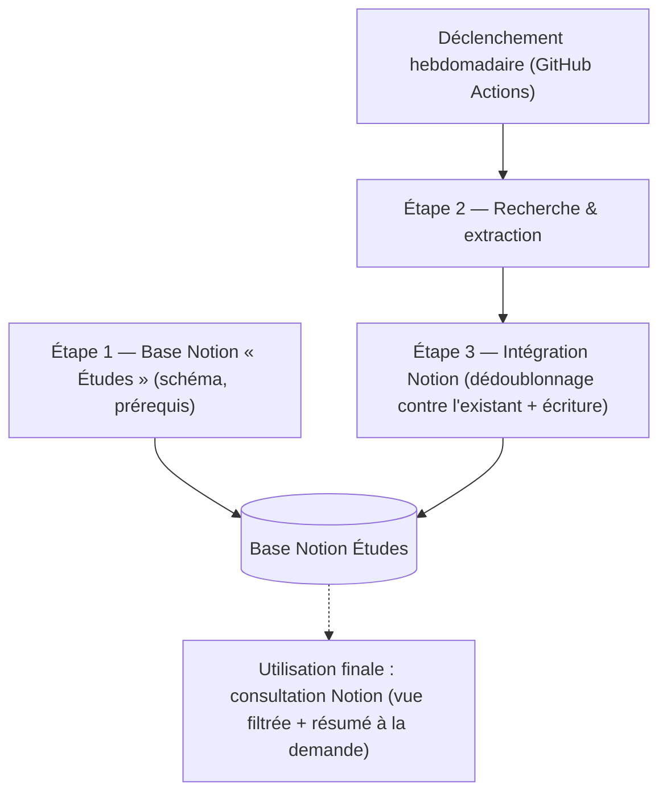

# Plan d'action — Veille automatisée des études scientifiques bruit & santé (diagBruit)

*Document de cadrage du plan d'ensemble. Chaque étape est détaillée dans son propre document (`etape-N-*.md` pour le contenu métier, `etape-N-conception-technique.md` pour le détail d'implémentation, à produire au fil de la conception dans Claude Code).*

## Objectif final

Se constituer un suivi automatisé et hebdomadaire des publications scientifiques sur le lien entre bruit et santé (études européennes ou portant sur des populations européennes, ~10 dernières années), consultable dans Notion. Deux usages concrets attendus, rien de plus pour l'instant :
1. Voir en un coup d'œil le nombre de nouvelles publications trouvées sur la dernière semaine.
2. Disposer, à la demande, d'un résumé synthétique d'une publication qui intéresse l'utilisateur, avec accès direct à sa source.

## Sortie visée

Une base Notion **"Études"** tenue à jour chaque semaine sans intervention humaine, alimentée automatiquement, sans doublon.

## Schéma du plan

*Ce schéma représente le flux hebdomadaire une fois le prérequis (étape 1) en place. L'étape 4 (automatisation) n'apparaît pas comme un bloc de traitement séparé : c'est elle qui déclenche périodiquement l'ensemble du flux "Trigger → E2 → E3".*

## Étapes du plan

1. **Base Notion "Études"** — schéma des colonnes qui structurent chaque fiche d'étude. Prérequis, exécuté une seule fois (pas dans la boucle hebdomadaire). ✅ conçu.
2. **Recherche & extraction** — recherche hebdomadaire des nouvelles publications (deux canaux complémentaires) et extraction structurée des champs de chaque étude retenue. ✅ conçu (ce document de passation).
3. **Intégration Notion** — vérification des doublons contre les fiches déjà présentes dans la base, puis écriture des nouvelles fiches. À concevoir.
4. **Automatisation** — planification de l'exécution hebdomadaire (GitHub Actions), gestion des secrets (clés API Anthropic et Notion). À concevoir.

## Points de vigilance retenus

- **Une seule base Notion**, sans dashboard ni base "digests" séparée pour l'instant : le besoin exprimé (compter les nouveautés, lire un résumé à la demande) est déjà couvert par une vue Notion filtrée sur la date d'ajout et par la colonne de résumé. Une architecture plus riche a été envisagée puis écartée par souci de simplicité — à reconsidérer seulement si l'usage réel le justifie après quelques semaines.
- **Recherche hybride obligatoire** à l'étape 2 : un canal de recherche web générale et un canal d'API scientifiques structurées ne couvrent pas le même type de contenu (voir `etape-2-recherche-extraction-diagbruit.md`) — aucun des deux seul ne suffit à l'exigence d'exhaustivité.
- **Prompt de recherche toujours daté explicitement** par le script (jamais une formulation relative du type "depuis ma dernière demande"), un appel API automatisé n'ayant pas de mémoire d'un run à l'autre.
- **Dédoublonnage à deux niveaux**, à ne pas confondre : un dédoublonnage interne à chaque run (fusion des deux canaux de recherche, étape 2) et un dédoublonnage contre l'existant (avant écriture dans la base Notion, étape 3).
