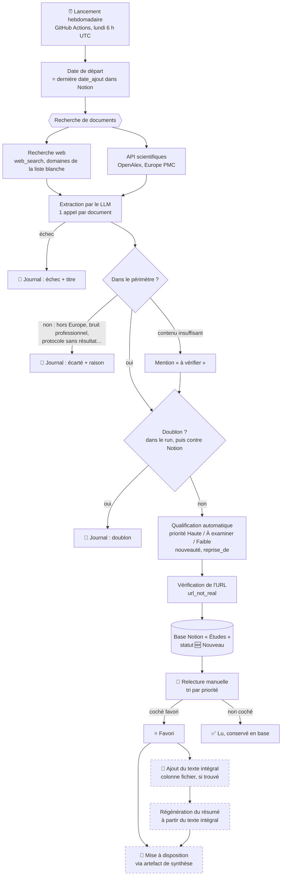

# Workflow de la veille bruit & santé

*Validé le 25/09/2026. Décrit le circuit complet d'un document, du scan hebdomadaire
jusqu'à sa mise à disposition. Les étapes en pointillés sont décidées mais pas encore
codées (voir `FEUILLE_DE_ROUTE.md` à la racine du dépôt).*

## Principes

- **Rien n'est écarté silencieusement.** Un document ne quitte le circuit qu'à trois
  endroits (échec d'extraction, hors périmètre, doublon), et chacun est inscrit dans le
  journal du run GitHub Actions avec le titre et la raison. Un contenu trop pauvre pour
  être jugé n'est pas exclu : il est écrit avec la mention « à vérifier ».
- **La priorité informe, la case `favori` décide.** La priorité (Haute / À examiner /
  Faible) est calculée automatiquement pour ordonner la relecture ; seule la case
  `favori`, cochée à la main, traduit le choix de l'utilisateur.
- **Rappel avant précision.** Mieux vaut plus de documents à trier à la main que manquer
  un favori potentiel.
- **La fiche Notion reste la source unique.** Le résumé régénéré à partir du texte
  intégral remplace celui de la fiche ; l'artefact de synthèse s'appuie sur les fiches.
